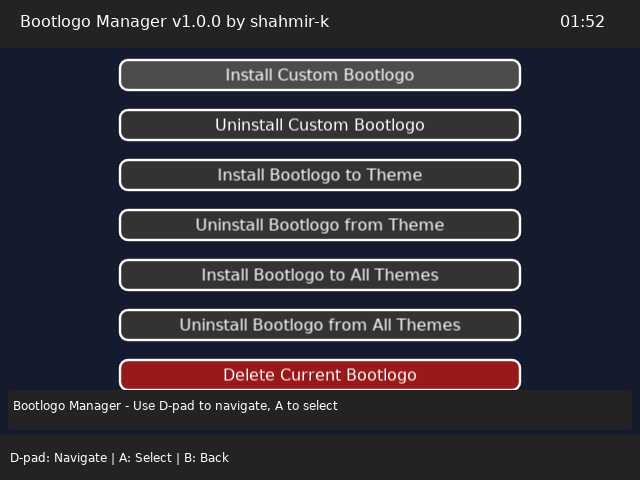

#  Bootlogo Manager for muOS

[](https://github.com/shahmir-k/Bootlogo-Manager-muOS/releases)
[](LICENSE)
[](https://muos.dev)
[](https://www.anbernic.com/products/rg35xxsp)
[](https://www.lua.org)
[](https://love2d.org)

A comprehensive tool for managing custom bootlogo installation and removal on gaming devices running **muOS**, specifically designed for the RG35XXSP. This application provides an intuitive graphical interface for customizing your device's boot screen.



**Currently only tested on the RG35XXSP.** Please try it out on your **muOS** device and open a GitHub issue if you encounter any problems.

## 🚧 Planned Features

- **🎲 Bootlogo Randomization**: Automatically shuffle between multiple bootlogos
- **📥 Direct Download**: Download bootlogos directly through the application

## 🚀 Current Features

- **🎨 Custom Bootlogo Installation**: Install custom `.bmp` bootlogo files
- **🔄 Bootlogo Restoration**: Uninstall custom bootlogos and restore defaults
- **🎭 Theme Integration**: Install/remove bootlogos from individual themes
- **🌐 Bulk Theme Management**: Apply bootlogos to all installed themes at once, as well as restore back to original
- **💾 Automatic Backup**: Creates backups before making any changes
- **🎮 Gamepad Support**: Full D-pad and button navigation
- **🖥️ Keyboard Fallback**: Mouse and keyboard for comprehensive input support
- **🛡️ Safe Operations**: Confirmation dialogs and error handling

- **Includes Mount Fiji Red Gyrados Boot Logo**: Includes my personal custom boot logo. Meant to match with the **Red Transparent RG35XXSP**


## 📋 Table of Contents

- [Planned Features](#-planned-features)
- [Current Features](#-current-features)
- [Installation](#-installation)
- [Usage: How to change Boot Logo in muOS](#-usage-how-to-change-boot-logo-in-muos)
- [Controls](#-controls)
- [Project Structure](#-project-structure)
- [Development](#-development)
- [Troubleshooting](#-troubleshooting)
- [Contributing](#-contributing)
- [License](#-license)

## 🔧 Installation

### Prerequisites

- **muOS Installation**: Your RG35XXSP or other device must be running muOS
- **SD Card Access**: Access to the muOS SD card for file transfer (physically or through network)
- **Installer Package**: All required binaries and libraries are included - no additional prerequisites required

### Installation Methods

#### Method 1: Package Installation (Recommended)

1. **Download the Package**

   - Download the latest `.muxupd` package from the [Releases](https://github.com/shahmir-k/Bootlogo-Manager-muOS/releases) page
   - Or build it yourself using the instructions further below

2. **Install via muOS Archive Manager**
   - Copy the `.muxupd` file to your RG35XXSP's `ARCHIVE` directory
   - Boot into muOS
   - Navigate to **Applications** → **Archive Manager**
   - Find and install the "Bootlogo Manager" package
   - The system will automatically set permissions and reboot

#### Method 2: Build from Source

1. **Clone the Repository**

   ```bash
   git clone https://github.com/shahmir-k/Bootlogo-Manager-muOS.git
   cd Bootlogo-Manager-muOS
   ```

2. **Create Package** (Windows)

   ```powershell
   .\create-archive.ps1
   ```

3. **Install the Package**
   - Copy the generated `bootlogo-manager-1.0.1-install.muxupd` file to your RG35XXSP's `ARCHIVE` directory
   - Follow the installation steps in Method 1

### What the Package Does

The `.muxupd` package automatically:

- ✅ Copies all application files to the correct location
- ✅ Sets proper permissions for all executables
- ✅ Installs the application icon in muOS
- ✅ Configures system integration
- ✅ Reboots the device to complete installation

### Verification

After installation, the application will appear in:

- **muOS Applications Menu** → **Bootlogo Manager**

## 📝 Usage: How to change Boot Logo in muOS

### Launching the Application

1. **Boot into muOS**
2. **Navigate to Applications** in the muOS menu
3. **Find and launch "Bootlogo Manager"**

### Available Operations

| Operation                     | Description                                                    | File Type |
| ----------------------------- | -------------------------------------------------------------- | --------- |
| **Install Custom Bootlogo**   | Override the current bootlogo with a custom bootlogo           | `.bmp`    |
| **Uninstall Custom Bootlogo** | Restore the original bootlogo that was overwritten             | N/A       |
| **Install to Theme**          | Add current bootlogo to a specific theme                       | `.muxthm` |
| **Uninstall from Theme**      | Remove bootlogo from a specific theme and restore the original | `.muxthm` |
| **Install to All Themes**     | Apply bootlogo to all installed themes                         | N/A       |
| **Uninstall from All Themes** | Remove bootlogo from all themes, restoring the originals       | N/A       |
| **Delete Current Bootlogo**   | Remove current bootlogo without backup                         | N/A       |

### File Requirements

- **Bootlogo Files**: Must be `.bmp` format
- **Theme Files**: Must be `.muxthm` format
- **Resolution**: Compatible with RG35XXSP display (640x480) but may be compatible with other displays.

## 🎮 Controls

### Gamepad Controls (Primary)

| Control              | Action                        |
| -------------------- | ----------------------------- |
| **D-pad Up/Down**    | Navigate between menu options |
| **A Button**         | Select/Activate option        |
| **B Button**         | Back/Exit application         |
| **D-pad Left/Right** | Navigate popup options        |

### Keyboard Controls (Fallback)

| Key             | Action                 |
| --------------- | ---------------------- |
| **Arrow Keys**  | Navigate menu options  |
| **Enter/Space** | Select/Activate option |
| **Escape**      | Back/Exit application  |

## 📁 Project Structure

```
Bootlogo Manager/
├── .bootlogo/                    # Main application directory
│   ├── bin/                      # Binary files and libraries
│   │   ├── love                  # LÖVE engine binary
│   │   └── libs.aarch64/         # Required libraries
│   ├── conf.lua                  # LÖVE engine configuration
│   ├── config.lua                # Application configuration
│   └── main.lua                  # Main application entry point
├── package/                      # Package management
│   └── mux_launch.sh             # muOS launcher script
├── assets/                       # Application assets
│   └── glyph/                    # Icon files
├── BootlogoManager.sh            # Main launcher script
├── create-archive.ps1            # Package creation script
└── README.md                     # This file
```

## 🛠️ Development

### Technology Stack

- **LÖVE Game Engine**: Lua-based 2D game framework
- **muOS Integration**: Custom launcher scripts and system integration
- **gptokeyb**: Gamepad to keyboard input handling
- **PowerShell**: Package creation and automation

### Building from Source

1. **Clone the Repository**

   ```bash
   git clone https://github.com/shahmir-k/Bootlogo-Manager-muOS.git
   cd Bootlogo-Manager-muOS
   ```

2. **Create Package** (Windows)

   ```powershell
   .\create-archive.ps1
   ```

3. **Test Locally** (if LÖVE is installed)
   ```bash
   love .bootlogo/
   ```

### Debug Output

To view debug information and troubleshoot issues:

#### Method 1: SSH Connection (Recommended)

```bash
ssh root@[RG35XXSP_IP]
cd "/mnt/mmc/MUOS/application/Bootlogo Manager"
./BootlogoManager.sh
```

#### Method 2: Direct Execution

```bash
cd "/mnt/mmc/MUOS/application/Bootlogo Manager"
./.bootlogo/bin/love .
```

## 🔍 Troubleshooting

### Common Issues

| Issue                       | Solution                                          |
| --------------------------- | ------------------------------------------------- |
| **Application won't start** | Check file permissions: `chmod +x *.sh`           |
| **Input not working**       | Verify gptokeyb configuration                     |
| **Missing libraries**       | Ensure all `.so` files are in `bin/libs.aarch64/` |
| **File browser empty**      | Check directory permissions and path              |
| **Installation fails**      | Verify SD card has sufficient space               |

### Log Locations

- **muOS Logs**: `/mnt/mmc/MUOS/log/`
- **Application Logs**: Check console output via SSH
- **System Logs**: `/var/log/` (if accessible)

### Error Messages

| Error                     | Meaning                    | Solution                           |
| ------------------------- | -------------------------- | ---------------------------------- |
| `Cannot access directory` | Permission or path issue   | Check permissions and path         |
| `No bootlogo.bmp found`   | Missing bootlogo file      | Verify file exists and is readable |
| `Failed to extract theme` | Corrupted or invalid theme | Try a different theme file         |

### Reporting Issues

When reporting issues, please include:

- **Device Model**: RG35XXSP
- **muOS Version**: Current version
- **Application Version**: 1.0.1
- **Steps to Reproduce**: Detailed steps
- **Expected vs Actual Behavior**: Clear description
- **Logs**: Any error messages or debug output

## 📄 License

This project is licensed under the GNU General Public License v3.0 - see the [LICENSE](LICENSE) file for details.

## 🙏 Acknowledgments

- **muOS Team**: For the excellent gaming OS
- **LÖVE Community**: For the amazing game engine
- **Retro Handheld Community**: For testing and feedback
- **Contributors**: Everyone who helps improve this project

## 📞 Support

- **GitHub Issues**: [Report bugs or request features](https://github.com/shahmir-k/Bootlogo-Manager-muOS/issues)
- **Discussions**: [Community discussions](https://github.com/shahmir-k/Bootlogo-Manager-muOS/discussions)
- **muOS Documentation**: [Official muOS docs](https://muos.dev)

---

**⚠️ Disclaimer**: This application modifies system bootlogo files. Always backup your original bootlogo before making changes. I am not responsible for any issues that may arise from using this tool.

**Made with ❤️ for the muOS community**
